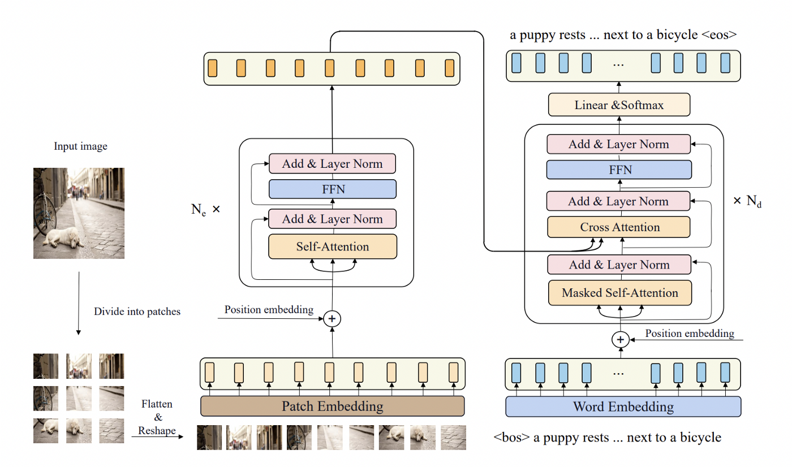
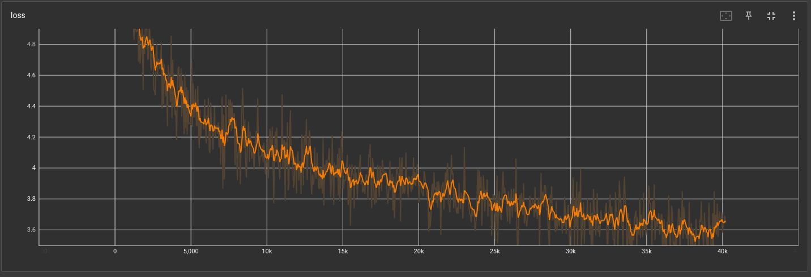
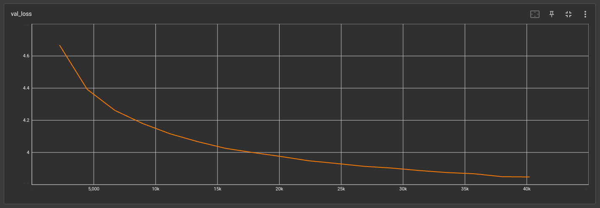
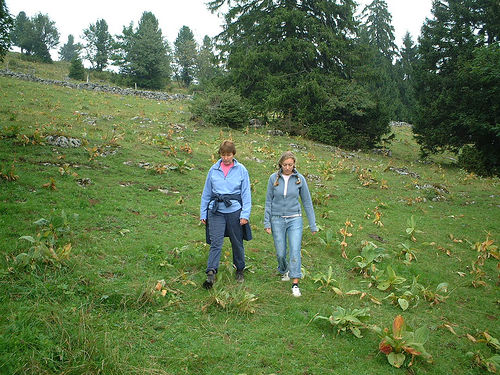

# Caption Images

## Architecture
This project uses a transformer, to process the images and generate captions for them.

Read [ViT research paper](https://arxiv.org/abs/2010.11929) for more details about, How to use transformer for images ?

## Dataset

I used [this](https://www.kaggle.com/datasets/hsankesara/flickr-image-dataset) kaggle dataset, which contains about 30k images with multiple captions (about 5 captions for each image) from flickr30k.

## Results

**Train Loss Plot**

**Test Loss Plot**

## Demo

We have a angular application, [here](ng-demo/)

Steps to run:
 - `cd ng-demo`
 - `npm i`
 - `ng serve`

Now, Enjoy you running demo on `localhost:4200`

## Generated Captions

>\
>**Caption:** A young boy in white shirt

>\
>**Caption:** A group of people in a parade .

>\
>**Caption:** A young boy in a green shirt and blue jeans running through a grassy area .
